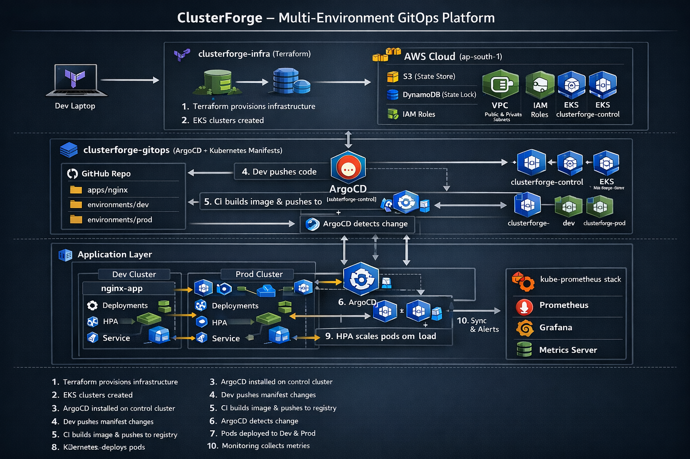
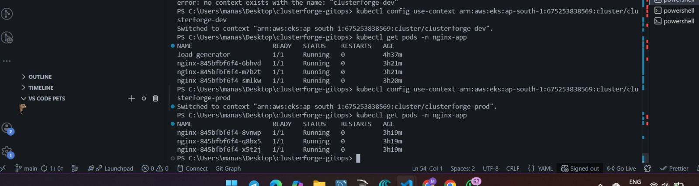

# 🚀 ClusterForge — Multi-Environment GitOps Platform for Kubernetes:

A distributed multi-cluster Kubernetes system designed to manage multiple environments, where infrastructure provisioning, application deployment, scaling, and monitoring are fully automated using GitOps workflows, with built-in scalability and observability powered by Terraform, AWS EKS, and ArgoCD.

***This project demonstrates how real Dev, Prod, and Control environments can be managed declaratively and reproducibly.***

# 🧩 Problem vs Solution (Real-World Production Context) :

| 🚨 Real-World Problem | ❌ What Typically Happens in Teams | ✅ ClusterForge Solution |
|-----------------------|-----------------------------------|--------------------------|
| 🌍 Dev works, Prod breaks | Dev works, Prod breaks  Manual configuration differences between clusters. | Terraform modules create identical, reproducible clusters. |
| 🔁 “Who changed this?” incidents | ```kubectl apply``` manually Cluster state diverges from Git. | ArgoCD enforces Git as the single source of truth. |
| ⏳ Traffic drops during deployment | Pods are terminated before new ones are ready; users see downtime | Rolling update strategy with readiness & liveness probes |
| 📉 Application crashes during traffic spike | Static replica count; no autoscaling; manual intervention required | HPA dynamically adjusts replicas based on CPU metrics |
| 🔍 Incident debugging takes hours | Teams check only `kubectl logs`; no metrics visibility | Prometheus monitoring stack provides real-time metrics and observability |
| 🏗️ No one knows how infra was created | Click-ops in AWS console; no documentation; hard to recreate environments | Fully declarative Infrastructure as Code (Terraform) |
| 🔐 Over-permissioned IAM roles | Static credentials and broad policies increase security risk | IAM roles with least privilege + OIDC provider integration |
| 💥 Terraform destroy fails midway | AWS resources have hidden dependencies (e.g., NAT → subnets → VPC); incorrect deletion order causes failures and manual cleanup | Dependencies are explicitly handled and validated, ensuring clean and complete teardown of infrastructure |
| 🌐 Flat networking causes exposure | All services share same subnet; poor isolation between workloads | Multi-AZ VPC with public/private subnet isolation |
| 📦 Dev accidentally affects Prod | Single cluster used for multiple environments | Dedicated EKS clusters per environment |
| 📊 Monitoring added after outage | Metrics and alerting introduced only after a production incident | Monitoring integrated as a core platform layer |
| 🔄 Cluster management chaos | Multiple clusters manually accessed and configured | Central control cluster managing environments via GitOps |


## 📂 Project Structure:

The following represents the folder structure of the **ClusterForge Infrastructure Repository**, responsible for provisioning networking, security, and multi-environment Kubernetes clusters using Terraform.

```
clusterforge-infra/
│
├── modules/  # Reusable Terraform modules
│
│   ├── vpc/  # VPC, subnets, routing, NAT, gateways
│   │   ├── main.tf        # Defines networking resources
│   │   ├── variables.tf   # CIDR, AZs, subnet configs
│   │   └── outputs.tf     # VPC ID, subnet IDs
│
│   ├── eks/  # EKS cluster + node groups
│   │   ├── main.tf        # EKS, node groups, IRSA
│   │   ├── variables.tf   # Cluster config inputs
│   │   └── outputs.tf     # Endpoint, OIDC, node details
│
│   └── iam/  # IAM roles and policies
│       ├── main.tf        # Roles, policies, OIDC trust
│       ├── variables.tf   # Role configs
│       └── outputs.tf     # Role ARNs
│
├── main.tf         # Root module wiring VPC, IAM, EKS
├── variables.tf    # Global configuration variables
├── outputs.tf      # Exported infrastructure outputs
├── providers.tf    # AWS provider configuration
├── backend.tf      # Remote state (S3 + DynamoDB)
├── README.md       # Project documentation
├── LICENSE         # License file
└── .gitignore      # Ignore local/terraform files

```
### 🔗 How Modules Work Together

- VPC → provides networking  
- IAM → provides permissions  
- EKS → uses both to create clusters  

👉 Modules are separate but connected through inputs/outputs.

The application deployment layer of this project — including Kubernetes manifests, ArgoCD configuration, and the multi-environment GitOps workflow — is maintained in a separate repository.

🔗 **ClusterForge GitOps Repository:**  
https://github.com/immanas/clusterforge-gitops

### 📂 Repository Separation (Why two repos?)
- clusterforge-infra → builds infrastructure  
- clusterforge-gitops → deploys applications  

👉 Infra creates the platform, GitOps manages what runs on it.

##  🏗️ Architecture Diagram:



## 📈 Core Features:

| ✅ What This Project **IS** | ❌ What This Project is **NOT** |
|--------------------------|------------------------------|
| Multi-Environment Kubernetes Platform — Dev, Prod, and Control clusters running on Amazon EKS | Not a single-cluster Kubernetes demo |
| Infrastructure as Code (Terraform) — Fully provisioned VPC, IAM, and EKS using reusable modules | Not a static YAML-only deployment |
| Centralized GitOps Control Plane — ArgoCD runs in control cluster and deploys apps to dev/prod clusters | Not a CI/CD-only showcase without real infrastructure |
| 🚀 Production-Grade Deployment — NGINX with rolling updates, probes, and health checks | Not a local Minikube experiment |
| 📈 Auto-Scaling Enabled — Horizontal Pod Autoscaler (HPA) based on CPU metrics | Not a toy monitoring setup without scaling validation |
| 📊 Observability Integrated — Metrics Server + Prometheus + Grafana | Not a slide-based architecture without live proof |
| 🔐 Secure by Design — IAM roles, OIDC (IRSA), private subnets, controlled networking |  |
| 🧱 Modular & Scalable Architecture — Designed for real-world extensibility |  |


This project demonstrates a **real, deployable, multi-cluster cloud-native platform** — built and validated end-to-end.
## 🧰 Tech Stack:

This project combines Infrastructure as Code, Kubernetes orchestration, and GitOps-driven deployment to build a production-style multi-cluster platform.

### ☁ Cloud Platform
- **AWS (ap-south-1)** – Primary cloud provider
- **Amazon EKS** – Managed Kubernetes control plane
- **Amazon VPC** – Custom networking (public/private subnets, NAT, IGW),
- Flow:Internet → Public Subnet → NAT → Private Subnet → EKS Nodes → Pods
  
### 🔐 Identity & Access (IRSA)
IIAM Roles for Service Accounts (IRSA) allows Kubernetes pods to securely access AWS services.
Instead of storing AWS credentials inside containers:
- Each pod is linked to an IAM role
- AWS verifies identity using OIDC (OpenID Connect)
👉 Flow:
Pod → OIDC identity → IAM Role → AWS service
- **KMS** – Encryption at rest for cluster secrets
- **CloudWatch** – Control plane logging
- **S3 + DynamoDB** – Terraform remote backend & state locking

### 🏗 Infrastructure as Code
- **Terraform (>= 1.5)** – Modular infrastructure provisioning
- Reusable modules: `vpc`, `eks`, `iam`
- Remote state management for safe multi-user workflows

### ☸ Container Orchestration
- **Kubernetes (EKS 1.29+)**
- **Managed Node Groups**
- **Horizontal Pod Autoscaler (HPA)**
- Rolling updates & self-healing deployments

### 🔁 GitOps & Deployment

ArgoCD acts as the GitOps controller running inside the control cluster.

Flow:
- ArgoCD watches the GitOps repository
- Detects changes in Kubernetes manifests
- Connects to target clusters (dev / prod) using stored cluster credentials
- Applies changes automatically and keeps clusters in sync with Git

👉 This ensures Git is always the single source of truth for deployments

### 📦 Application Layer
- **Docker** – Containerized Nginx application
- Kubernetes manifests:
  - Deployment
  - Service
  - HPA
  - Namespace

### 🛠 Tooling
- kubectl

## 📸 Infrastructure Proof

### 1️⃣ Multi-Environment EKS Clusters


---

### 2️⃣ Custom VPC Architecture
Public & private subnets across multiple AZs with proper routing.


---

### 3️⃣ Worker Nodes (Managed Node Groups)
EKS-managed EC2 instances running in private subnets.


---

### 4️⃣ GitOps Deployment via ArgoCD
Applications synced and healthy across dev & prod clusters.


---

## 🔄 Request Lifecycle:

***End-to-End Flow:***

**Runtime Request Flow**
1. User sends request to Kubernetes Service
2. Service forwards traffic to one of the running Pods
3. Pod processes the request (Nginx container)
4. Metrics Server collects CPU usage
5. HPA evaluates metrics:
   - If CPU > threshold → increase replicas
   - If CPU normal → maintain or reduce replicas

👉 This creates a self-healing and auto-scaling system without manual intervention.

***Why This Design?***

- Clear separation of infra and app layers.
- Multi-environment isolation.
- Git-driven declarative deployment.
- Production-aligned Kubernetes architecture.

## 🛡 Resilience & Security:

***Failure Scenarios***
- Node failure → Pods rescheduled automatically.
- Pod crash → Kubernetes self-healing restarts container.
- High traffic → HPA scales replicas.
- Terraform drift → Reconciliation via `terraform apply`.

***Security Considerations***
- Private subnets for worker nodes.
- IAM least-privilege roles.
- IRSA for workload identity.
- Encrypted EKS secrets via KMS.
- Remote state locking via DynamoDB.

***Scalability & Performance***
- Managed node group scaling.
- Horizontal Pod Autoscaler.
- Multi-AZ subnet distribution.
- Stateless application design.

## ⚡ Quickstart (30-Second Run) :

> Prerequisites:
> - EKS clusters (control, dev, prod) already provisioned via `clusterforge-infra`
> - ArgoCD installed on the control cluster
> - kubectl configured
> - ArgoCD CLI installed

***Switch to Control Cluster***
```bash
kubectl config use-context <control-cluster-context>
```

***2️⃣ Apply ArgoCD Applications***

Deploy Dev and Prod applications:
```
kubectl apply -f environments/dev/app.yaml
kubectl apply -f environments/prod/app.yaml
```
***3️⃣ Verify ArgoCD Sync***

- argocd app list
- You should see:
```
nginx-dev → Synced & Healthy
nginx-prod → Synced & Healthy
```
***4️⃣ Validate Deployment in Target Cluster***

Switch to dev or prod cluster:
```
kubectl config use-context <dev-cluster-context>
kubectl get pods -n nginx-app
kubectl get hpa -n nginx-app
```
You should see:
```
Running NGINX pods
```
HPA configured and active

## ⚙ Engineering Philosophy:

***Trade-offs & Decisions***

- **Chose EKS over self-managed Kubernetes**
  → Offloads control plane management, upgrades, and HA complexity to AWS.  
  → Focus stays on platform design and workload reliability instead of etcd and master node operations.
- **Separated infra and GitOps repositories**
  → Enforces clear ownership boundaries between platform and application layers.  
  → Reduces blast radius and aligns with real-world DevOps team structures.
- **Used Managed Node Groups**
  → Simplifies lifecycle management (auto-repair, scaling, upgrades).  
  → Avoids operational overhead of maintaining custom worker AMIs and autoscaling groups.
- **Prioritized Infrastructure as Code over manual console setup**
  → Guarantees reproducibility and auditability.  
  → Eliminates configuration drift and enables safe teardown/rebuild cycles.

***Explicit Limitations***
- No production-grade ingress controller (for simplicity).
- No service mesh implemented.
- Monitoring stack optional (not hardened for production).

### 🙌 Contributions Welcome!
ClusterForge is an open-source initiative, and we welcome contributions from developers, data scientists, cloud engineers, and Devops enthusiasts!

### 💡 Ideas You Can Work On:

- Add production-grade Ingress + ALB.
- Integrate full Prometheus/Grafana monitoring.
- Implement CI validation for Terraform plans.
- Add cost optimization policies.
- Introduce blue/green deployment strategy.

### 🛠️ How to Contribute:
- 🍴 Fork the repo
- 📦 Create a new feature branch: ```git checkout -b feature-name```
- ✅ Make your changes and test them
- 📬 Submit a pull request describing your enhancement
- 🤝 Let's Build This Together! Made with 💚 by Manas Gantait

